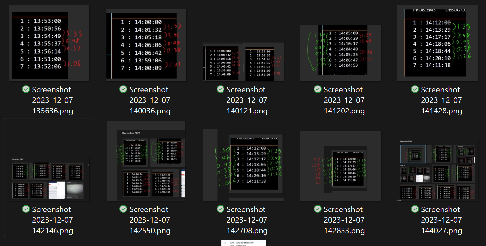
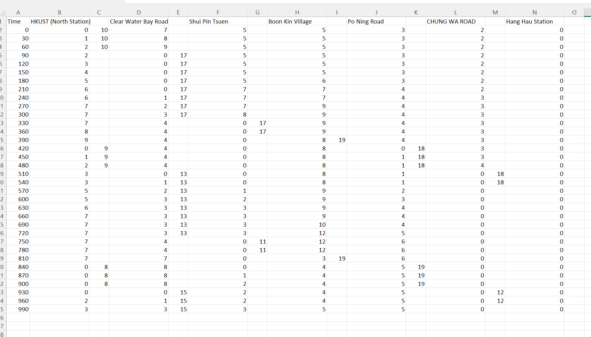
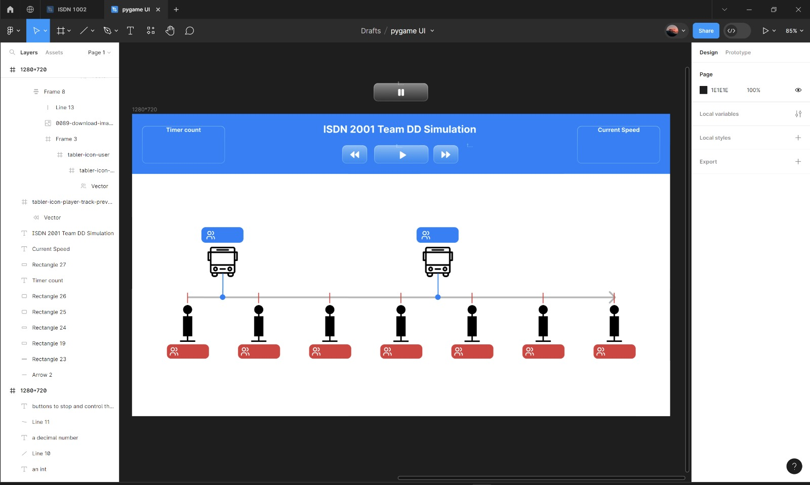

# [Individual Design Log - by Tom](https://hwtam.github.io/ISDN2001-teamDD/)

## Team log
19/09
- form a team of Brandon, Dan, Tom, Jimmy, Matt, Ziyi
- deciding the topic

21/09
- divide into 2 subteams to do the market research : 
  - Fast commuting : Tom, Jimmy, Ziyi 
  - Transport hygiene : Brandon, Dan, Matt, Jimmy

24/09
- online meeting to draft the market research of both teams

26/09
- f2f meeting to finish the user modeling and market research
- proposed new topic(Sustainable clothing)

13/10
- change the topic to designed driver
- start the ppt for the problem definition review

17/10
- presentation
- decide the team name(DD)

24/10
- make a timetable so that we know when all of us are free

02/11
- changed the topic to showing occupancy of minibus to passengers(the current topic)(final)

07/11
- weekly 2001 meeting, plan to interview KMB, Saikung Minibus Operator, Pulse, USTransit

13/11
- brainstorming ideas for people counting

14/11
- open a [notion page](https://www.notion.so/teamdd/invite/55adbda4d5dcbc02df93d6a773923913cf9c98be)
- interview pulse

15/11
- interview socif

21/11
- basic planning of division of labor

23/11
- basic planning of what to do for the 2001 final presentation
  - Decide camera to buy
  - Confirm details of bus rental for experiment
  - Sort out all options for human detection model
  - Mini-minibus stimulation

24/11
- go to "Location matters" event

05/12
- go to "infineon Day" event

11/12
- decide to use youtube video instead of renting a minibus for the testing of people counting

12/12
- Matt designed the UI of SpeeDD(the product/software)

15/12
- start doing the ppt for conceptual design review
- Ziyi record video at North gate in ust for testing the people counting algorithm/software

16/12
- presentation

22/12
- make the [design log](https://github.com/hwtam/ISDN2001-teamDD/blob/simulation_v5/docs/index.md)

 

 

## Simulation prototype log
### [Github commit log here](https://github.com/hwtam/ISDN2001-teamDD/commits)

27/11
- make a [model](https://www.canva.com/design/DAF1U-2nVa4/tthAYAMsnmWHyW39IpZPLQ/edit) to sort out the relationship of different parameters of the simulation

29/12
- find the minibus ETA api

06/12
- basic planning for the simulation prototype(Jimmy&Tom)
- Jimmy and I done the [code for getting the ETA of minibus](https://github.com/hwtam/ISDN2001-teamDD/blob/simulation_v5/data_collection/eta.py)

07/12
- Used the ETA of 11M to predict the time needed to arrival each stop

09/12
- Done [v1](https://github.com/hwtam/ISDN2001-teamDD/tree/simulation_v1), to show the simulation process in terminal, for testing purpose
- Done the basic simulation algorithm
- Done [v2](https://github.com/hwtam/ISDN2001-teamDD/tree/simulation_v2), to store the simulation process data to a excel file, for manually generating graph in excel to visualize  the data

10/12
- Matt designed the UI for the simulation

13/12
- Done [v3](https://github.com/hwtam/ISDN2001-teamDD/tree/simulation_v3), to visualize  the simulation using pygame for a better GUI and interaction, for demo purpose

15/12
- Done v4(merged into v5), the color of stop/people count changes in different states to help visualize  the data
- Done [v5](https://github.com/hwtam/ISDN2001-teamDD/tree/simulation_v5)(the current version), based on v4 but with an even better interaction design, able to click on minibus/stop to show a graph for visualizing the data

 

 

I want to focus on prediction
- Predict when will the passenger get on the minibus
- Suggest which transportation to take for the passenger

Possible direction
- designing algorithm to predict the traffic and for the suggestion
- make use of AI model to predict the traffic based on historic data and for the suggestion
